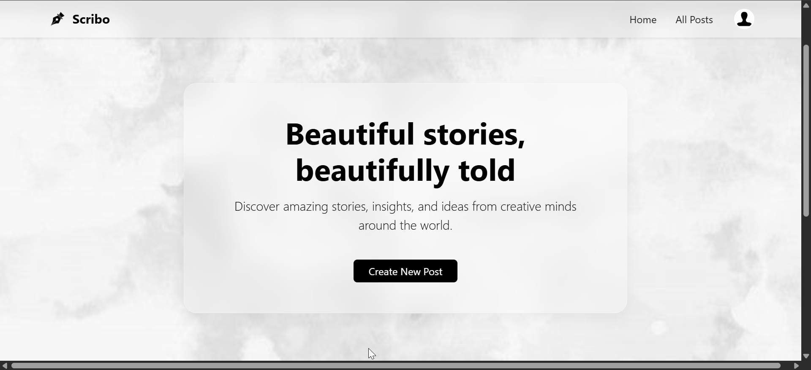
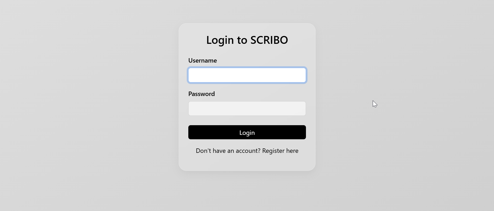
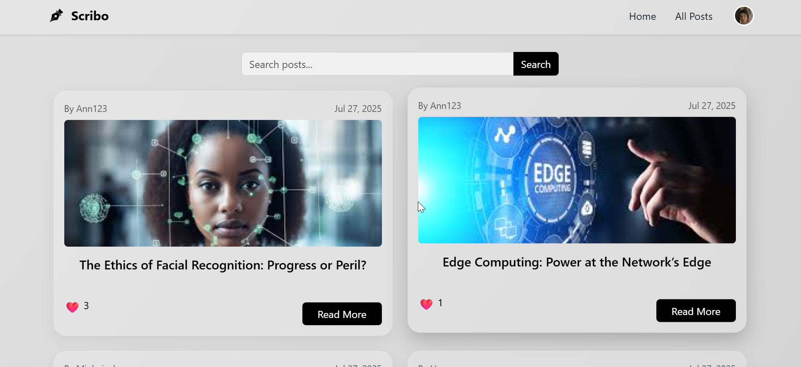
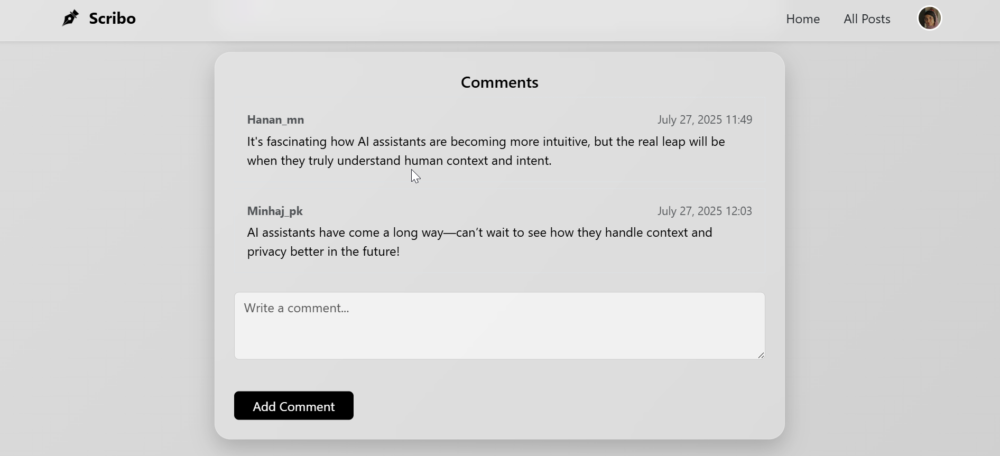
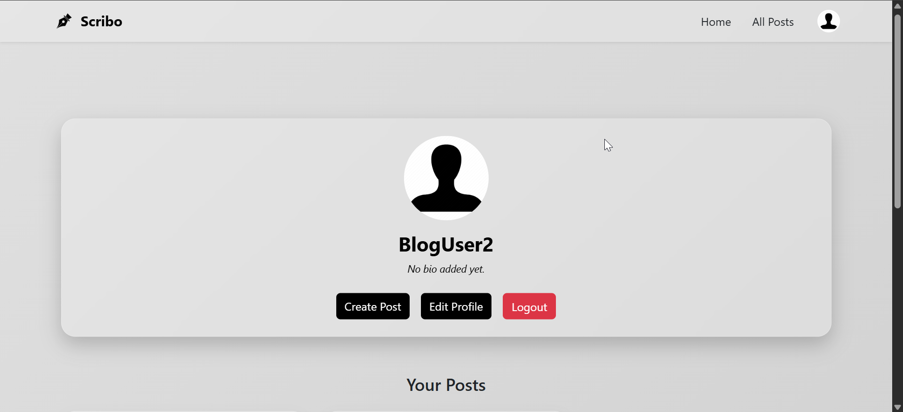

# 📓 ScriboBlogApp

A minimalist, responsive blog web application built with Django, Django REST Framework (DRF), and AJAX. Scribo allows users to create and explore beautiful stories, interact through likes and comments, and access a smooth API interface.

---

## 🚀 Features

### 👤 User Authentication
- User registration, login, and logout with form-based authentication.
- Only authenticated users can create posts, comment, or like.

### 📝 Blog Posts
- Create, read, update, delete (CRUD) posts.
- Image upload support for posts.
- Each post displays author, image, created date, and number of likes.

### 💬 Comments
- View and add comments dynamically using AJAX (no page reload).
- Only the comment author can edit or delete their comment.

### ❤️ Likes
- Toggle like/unlike on posts with real-time feedback via AJAX.
- Displays updated like count instantly.

### 🌐 REST API (via DRF)
- `GET /api/posts/` – List all posts.
- `POST /api/posts/` – Create a post (auth only).
- `GET /api/posts/<id>/` – Retrieve a post.
- `PUT/PATCH/DELETE /api/posts/<id>/` – Update/delete (only author).
- `POST /api/posts/<id>/like/` – Like/unlike a post.
- `GET/POST /api/posts/<post_id>/comments/` – List or add comment.
- `PUT/DELETE /api/comments/<id>/` – Update/delete comment (only author).

### 🔍 Search & Pagination
- Search blog posts by title.
- Pagination for posts and comments (6 posts per page).

### 👤 User Profile
- View your posts and update profile picture or username.

### 💎 UI/UX
- Glassmorphic design with a responsive layout.
- Homepage hero section with watercolor background.
- Interactive form validation and dynamic updates.

---

## 🧪 API Testing Instructions

You can test the API using Postman or cURL. Example endpoints:

### 🔐 Auth (use Django session or token if added):
- Log in via UI first to gain session cookies.

### ✅ Get all posts
```bash
GET http://127.0.0.1:8000/api/posts/
```

### ✅ Like a post
```bash
POST http://127.0.0.1:8000/api/posts/1/like/
```

### ✅ Post a comment
```bash
POST http://127.0.0.1:8000/api/posts/1/comments/
{
  "text": "Nice article!"
}
```

---

## 📸 Screenshots

### 🏠 Homepage


### 🔐 Login Page


### 📰 All Posts


### 📝 Post Detail with Comments


### 👤 User Profile



---

## ⚙️ Setup Instructions

1. **Clone the repository**
```bash
git clone https://github.com/Hanan-m-naseer/ScriboBlogApp.git
cd ScriboBlogApp
```

2. **Create virtual environment and install dependencies**
```bash
python -m venv venv
source venv/bin/activate  # On Windows: venv\Scripts\activate
pip install -r requirements.txt
```

3. **Apply migrations and create superuser**
```bash
python manage.py migrate
python manage.py createsuperuser
```

4. **Run development server**
```bash
python manage.py runserver
```

5. **Visit the app**
```
http://127.0.0.1:8000/
```

